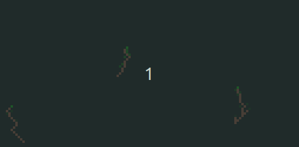
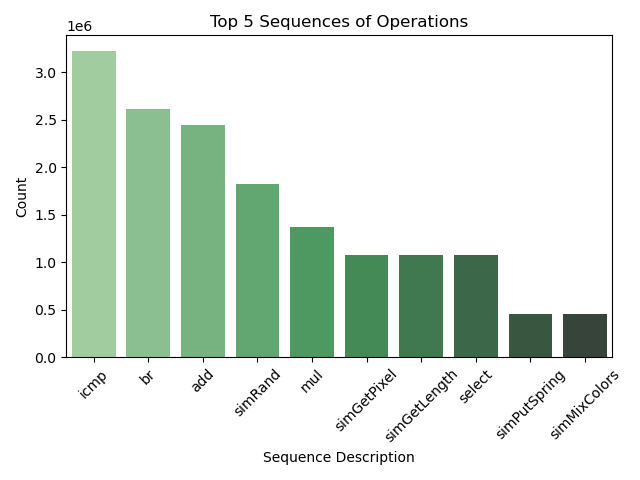
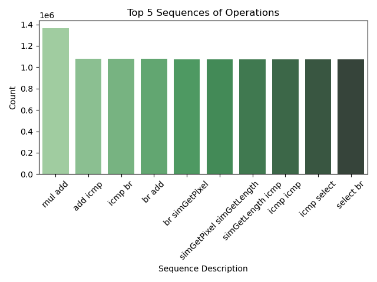
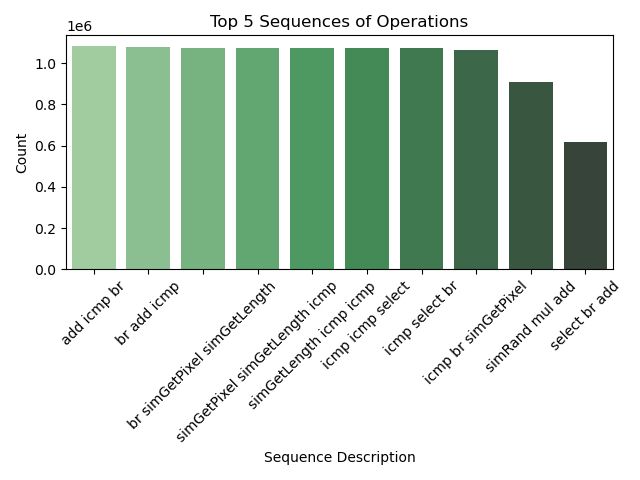
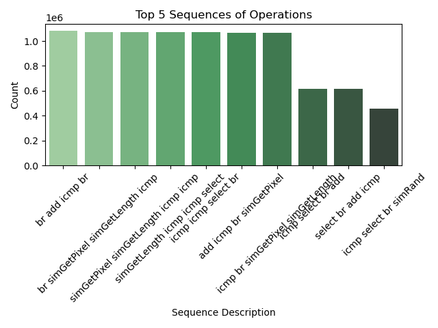
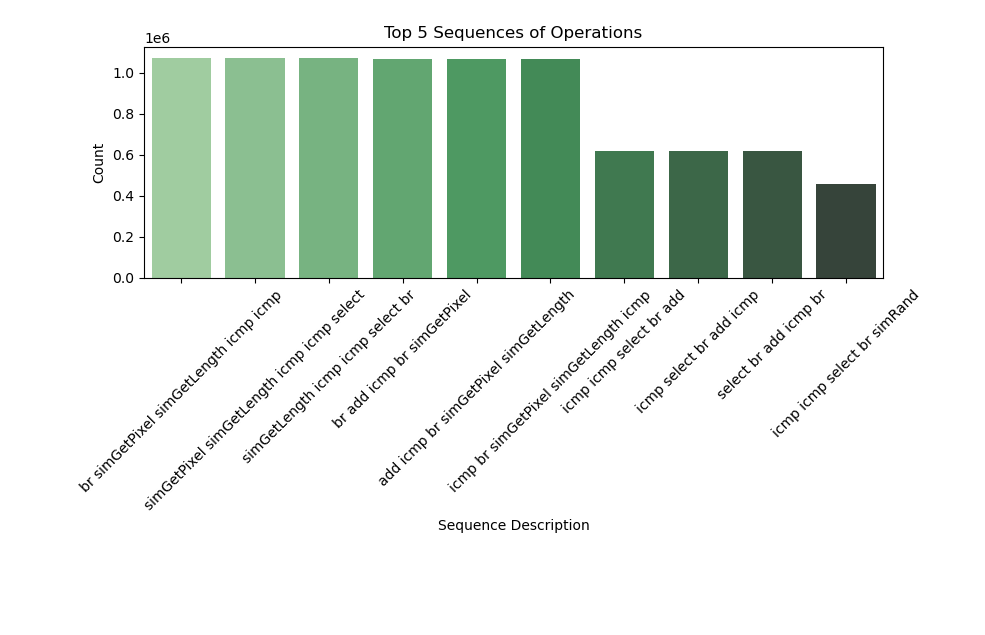

# Relax and check my garden...



# Relax and build my garden...

```
sudo apt install libsdl2-dev
cmake -B build
cd build
cmake --build .
./GardenApp
```

# Trace analyze

## How ?
I made a LLVM plugin that inserts logging function call after each operation of [app.c](./src/app.c).
Such kind of instrumentation gives us way to collect runtime statistics of executed operations.

## Why ?
This statistics later can be used to improve architecture of target machine:
If we see that user applications' frequently use some operation as hardware developers
we can optimize this operation.
If user application uses sequence of operation we might merge this opearation in one machine instruction.
So various optimizations can be taken.

## Implementation details

It occured that my original garden gives pretty dull statistics as major part of pixels doesn't do anythig.
So I changed original app from "calm garden" into "rapid growing bushes".

## Results

That's statistics for **top-10 executed instructions**:



Then I gathered this statistics for sequences of instructions.
Like may be there are some repeating patterns in the code?
Of course there will repeating patterns in the trace as my application is just sequence of
commands that is executed in the loop. But as you see some patterns still appear more frequent than
others. That means that **inside** one loop this patterns occur several times.

Also we see that some patterns do "chaining": end of one pattern is the begging of another.
This patterns belong to the same sequence of instructions in the code.
This sequence repeats many times as we execute this code in a loop.
So if we take any subsequence of this sequence we get pattern that will repeat
in the trace as many times as loop was executed during trace collection.








